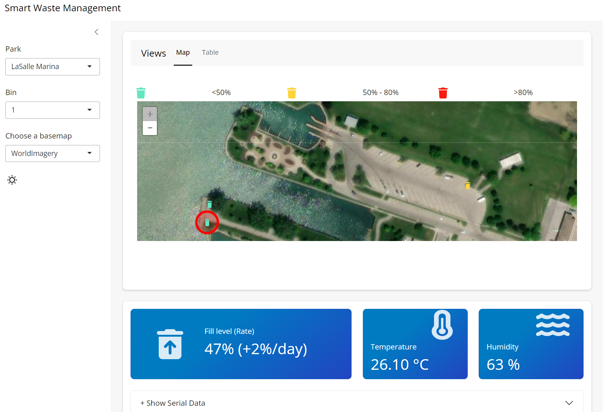
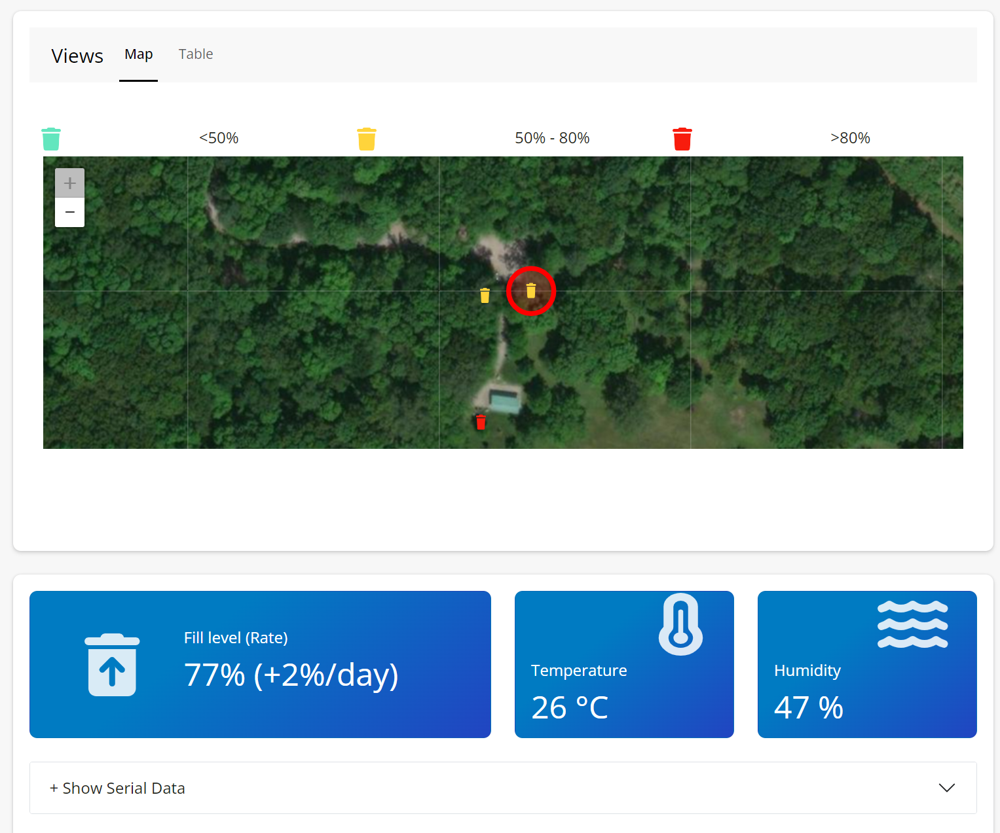
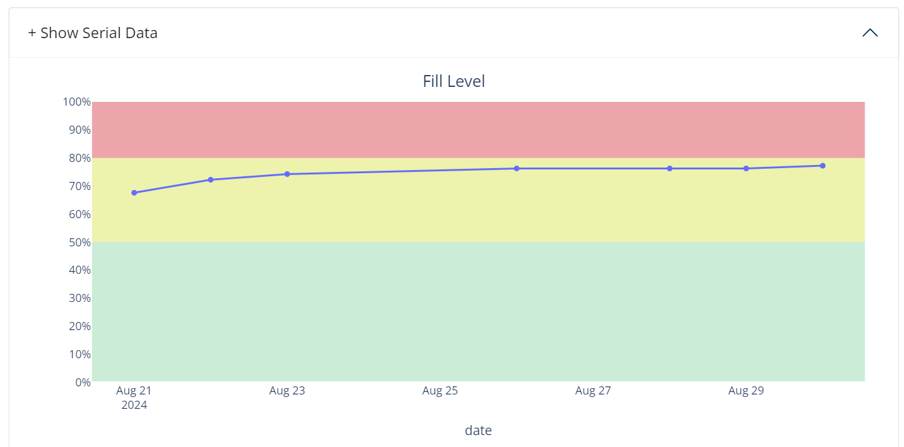
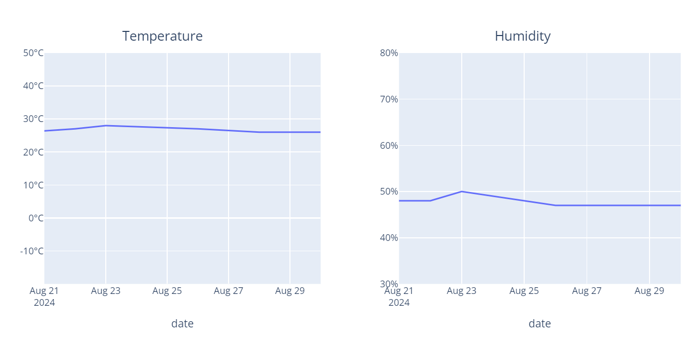

# Smart Waste Management Dashboard



## Overview

The **Smart Waste Management Dashboard** is an IoT-enabled data-driven solution to monitor and analyze waste collection data for parks and urban environments. This project provides an interactive web-based dashboard built with **Python**, **Shiny for Python**, and **Plotly**, allowing users to visualize the waste collection system using real-time data and advanced analytics.

The system focuses on tracking fill levels, temperature, and humidity in smart trash bins across different parks, optimizing waste collection routes, and predicting when bins need to be emptied. The data is gathered from IoT-enabled trash bins and displayed in an intuitive, easy-to-use interface.

[Live Demo](https://aro-dev.shinyapps.io/laselle-iot-dashboard/)

---

## Table of Contents
1. [Features](#features)
2. [Installation](#installation)
3. [Usage](#usage)
4. [Screenshots](#screenshots)
5. [Data](#data)


---

## Features

- **Real-time Monitoring**: Displays the fill level, temperature, and humidity of bins in multiple parks.
- **Interactive Map**: Shows the location of bins and their current fill status (color-coded based on thresholds).
- **Historical Data Analysis**: Displays historical data for each bin, including fill levels, temperature, and humidity trends over time.
- **Garbage Collection Detection**: Automatically detects when bins have been emptied and calculates the average fill level increase since the last collection.
- **Dynamic KPI Dashboard**: Provides real-time KPIs for each bin, such as fill levels, temperature, and collection status.
- **User-friendly**: Simple and intuitive interface for city officials, park managers, and sanitation workers.

---

## Installation

To run the Smart Waste Management Dashboard locally, follow these steps:

### Prerequisites
Make sure you have the following installed:
- **Python 3.8+**
- **Shiny for Python**
- **Plotly**
- **ipyleaflet**
- **pandas**
- **faicons** (for icons)

You can install the necessary dependencies using the `requirements.txt` file:

```bash
pip install -r requirements.txt
```

Clone the Repository
```bash
git clone https://github.com/your-username/laselle-iot-dashboard.git
cd laselle-iot-dashboard
```

Run the Dashboard
To run the dashboard locally:
```bash
python app.py
```


## Usage

Once you launch the app, you'll be presented with the following features:

1. **Select a Park**: Choose a park from the list.
2. **Select a Bin**: Once a park is selected, the available bins in that park will populate the bin selector.
3. **Interactive Map**: View the location of bins and their current fill level. Bins are color-coded:
   - Green: Below 50% full
   - Yellow: Between 50% and 80% full
   - Red: Above 80% full

4. **KPIs**: View real-time metrics for the selected bin (fill level, temperature, and humidity).
5. **Data Trends**: Check historical data trends for the bin’s fill levels, temperature, and humidity.

## Screenshots

Interactive Map with Bin Fill Levels



Historical Data Visualization




## Data

The project is powered by IoT data stored in a Google Spreadsheet. It includes:

- **Date and Time**: Timestamp of the data reading.
- **Bin Information**: Park name, bin number, and sensor readings (distance from the sensor to garbage, temperature, humidity).
- **Fill Level**: Calculated from the distance measured by an ultrasonic sensor.
- **Temperature and Humidity**: Environmental conditions affecting the bin's surroundings.

Data is processed and aggregated for each bin, calculating daily medians for each measure and identifying collection events.

